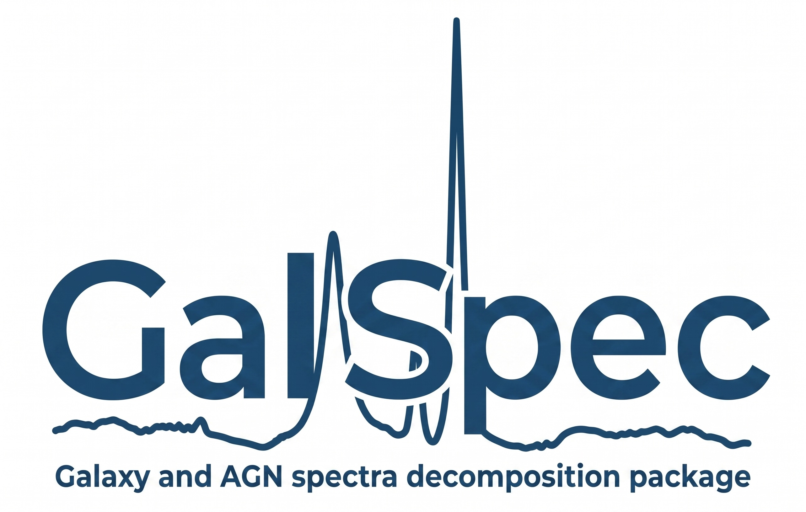

# GalSpec

Galaxy Spectrum Fitting

GalSpec is a Python package for fitting astronomical spectra, specifically designed for AGN and galaxy spectra with complex emission and absorption line features.

<p align="center">
  
</p>

## Key Features

- **Astropy Integration**: All models inherit from Astropy's modeling framework
- **Multiple Fitting Methods**: LSQ, MCMC (emcee), and nested sampling (dynesty)
- **Comprehensive Line Database**: Built-in UV/optical emission lines
- **Template Support**: Fe II and stellar population templates
- **Flexible Model Composition**: Easily combine continuum, line, and template components

## Documentation

Full documentation is available at: **https://jyshangguan.github.io/GalSpec/**

The documentation includes:
- Installation instructions
- Quick start tutorial with real SDSS data
- API reference for all modules
- Examples for continuum fitting, emission lines, absorption lines, and advanced techniques

## Installation

Install from source:

```bash
git clone https://github.com/jyshangguan/GalSpec.git
cd GalSpec
pip install -e .
```

## Claude Code Integration (Optional)

GalSpec includes a Claude Code skill that allows you to use GalSpec directly within Claude Code for interactive spectral fitting assistance.

To install the skill:

```bash
# From the GalSpec repository root
./install_skill.sh
```

This will:
- Create a symlink from `~/.claude/skills/galspec` to the `skills/` directory
- Enable GalSpec commands in Claude Code

To use the skill in Claude Code:
```
/skills
Use GalSpec to fit the spectrum
```

To uninstall:
```bash
rm ~/.claude/skills/galspec
```

## Quick Example

```python
import numpy as np
from astropy.modeling.models import Linear1D
from galspec import Line_Gaussian
from astropy.modeling.fitting import LevMarLSQFitter

# Load your spectrum
wave = np.linspace(6400, 6700, 1000)
flux = np.random.randn(len(wave)) * 0.1  # Your data here

# Define model: continuum + Hα line
continuum = Linear1D(slope=0.0, intercept=1.0)
halpha = Line_Gaussian(amplitude=5.0, dv=0, sigma=200, wavec=6563)
model = continuum + halpha

# Fit
fitter = LevMarLSQFitter()
fitted_model = fitter(model, wave, flux)

print(f"Hα amplitude: {fitted_model[1].amplitude.value:.3f}")
```

## Example Notebooks

The `example/` directory contains detailed notebooks demonstrating:
- Continuum fitting with stellar templates
- Emission line fitting for AGN
- Absorption line and BAL fitting
- Physical parameter estimation

## Requirements

- Python ≥ 3.9
- numpy, scipy, matplotlib, astropy, pandas
- emcee, dynesty (for Bayesian fitting)

## License

MIT License - see LICENSE file for details

## Links

- **Documentation**: https://jyshangguan.github.io/GalSpec/
- **GitHub Repository**: https://github.com/jyshangguan/GalSpec
- **Issue Tracker**: https://github.com/jyshangguan/GalSpec/issues
